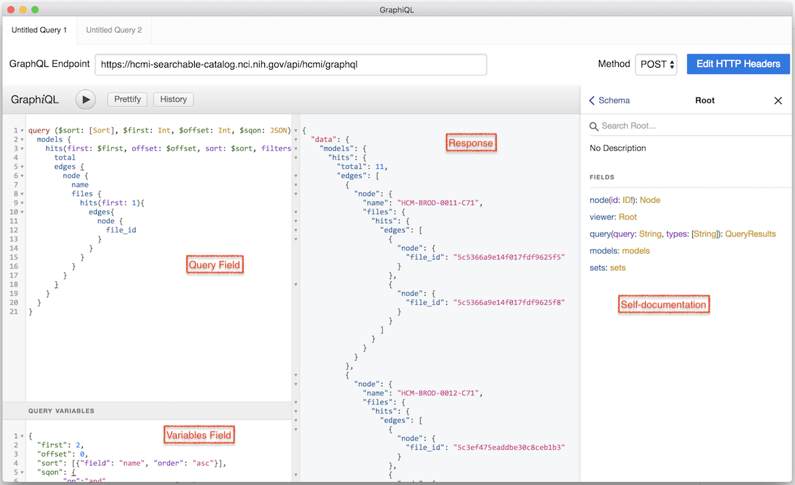
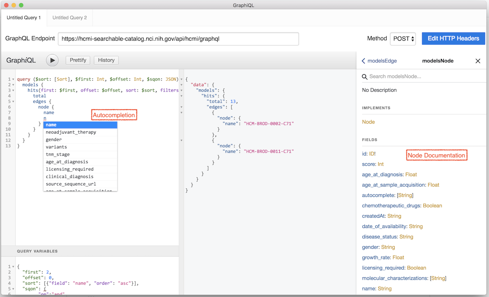
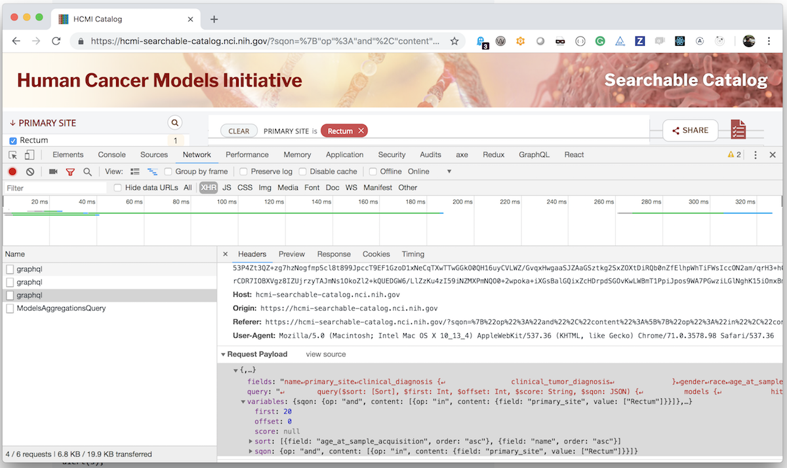

# Introduction

The HCMI Searchable Catalog was built with an extensive API allowing programmatic access to any data currently available through the user interface. The purpose of this documentation is to provide initial elements to start exploring HCMI data through its available APIs:

* A GraphQL API supporting search and exploration features
* A REST API providing HCMI-specific business logic

Data available through the API is structured following a data model available here: INSERT LINK @rosi

# Discover GraphQL

The HCMI GraphQL endpoint, available at `https://hcmi-searchable-catalog.nci.nih.gov/api/hcmi/graphql` is a standard GraphQL implementation. Detailed GraphQL documentation and resources are available on [GraphQL official website](https://graphql.org/learn/).

## Install and start GraphiQL electron app

The [Graphiql electron app](https://electronjs.org/apps/graphiql) provides a simple user interface to start querying the catalog GraphQL API. 

Once the application is installed, specify `https://hcmi-searchable-catalog.nci.nih.gov/api/hcmi/graphql` in the `GraphQL Endpoint` field.

This documentation will contain sample queries, you are encouraged to copy those into Graphiql and start exploring the data.




## Sample Query

In this first sample, we'll be requesting the first 5 cancer models, sorted by name as well as the total count of models available.

GraphQL Query
```graphQL
query ($sort: [Sort], $first: Int, $offset: Int, $sqon: JSON) {
  models {
    hits(first: $first, offset: $offset, sort: $sort, filters: $sqon) {
      total
      edges {
        node {
          name
        }
      }
    }
  }  
}
```

Variables
```json
{"first": 5, "offset": 0, "sort": [{"field": "name", "order": "asc"}]}
```

Results
```json
{
  "data": {
    "models": {
      "hits": {
        "total": 15,
        "edges": [
          {
            "node": {
              "name": "HCM-BROD-0003-C71"
            }
          },
          {
            "node": {
              "name": "HCM-BROD-0011-C71"
            }
          },
          {
            "node": {
              "name": "HCM-BROD-0012-C71"
            }
          },
          {
            "node": {
              "name": "HCM-BROD-0014-C71"
            }
          },
          {
            "node": {
              "name": "HCM-BROD-0028-C71"
            }
          }
        ]
      }
    }
  }
}
```

You could request the next 5 results, by setting the value of `offset` to 5, allowing you to [paginate through the results](https://graphql.org/learn/pagination/).

As mentioned earlier, GraphQL supports introspection. While using the Graphiql, the query field supports auto-completion and will automatically indicate possible values and display errors if some values are not compliant with the model.



## GraphQL Introspection

GraphQL supports [introspection](https://graphql.org/learn/introspection/). Using the `Docs` menu of GraphiQL, you can navigate through the schema and understand how to build queries.

Auto-completion is also provided by GraphiQL, with auto-suggestion of available fields. The entire model and its mapping can also be obtained by executing the following query:
```graphql
query{
  models {
    mapping
    extended
  }
}
```

## Learn more

The HCMI Catalog user interface uses GraphQL to fetch data, all calls being made are viewable through a web browser's developer console. 



# REST endpoints

The catalog also provides a limited number of REST endpoints to achieve specific tasks. Swagger-styled documentation for the REST API is available here: https://hcmi-searchable-catalog.nci.nih.gov/api/docs#

# Sample App using both GraphQL and Rest

Let's imagine one wants to build a web app displaying a gallery view, with 10 models per page, of only models containing images. The core API calls of this simple web app would be:

## GraphQL call to fetch data
A GraphQL query listing only models containing images:
```graphql
query ($sort: [Sort], $first: Int, $offset: Int, $sqon: JSON) {
  models {
    hits(first: $first, offset: $offset, sort: $sort, filters: $sqon) {
      total
      edges {
        node {
          name
          files {
	  hits(first: 1){
              edges{
                node {
                  file_id          
                }
              }
            }
          }
        }
      }
    }
  }  
}
```

This query would take the following variables:
```json
{
  "first": 10, 
  "offset": 0, 
  "sort": [{"field": "name", "order": "asc"}], 
  "sqon":{
        "op":"and",
        "content":[
          {
            "op":"in",
            "content":{
              "field":"files.file_type",
              "value":["image/jpeg"]
            }
          }
        ]
      }
}
```

Partial result:
```json
/*partial */
                  "edges": [
                    {
                      "node": {
                        "file_id": "5c5366a9e14f017fdf9625f5"
                      }
                    },
                    {
                      "node": {
                        "file_id": "5c5366a9e14f017fdf9625f8"
                      }
                    }
                  ]
/*partial */		  
                  "edges": [
                    {
                      "node": {
                        "file_id": "5c3ef475eaddbe30c8ceb1b3"
                      }
                    },
                    {
                      "node": {
                        "file_id": "5c3ef48eeaddbe30c8ceb1b9"
                      }
                    }
                  ]
/*partial */
```

## REST call to fetch model images

Using the value of file_id, a GET REST call can be made to fetch the images corresponding to a specific model.

For Example: 
```
GET https://hcmi-searchable-catalog.nci.nih.gov/api/data/images/5c5366a9e14f017fdf9625f5
```

# Conclusion

This short introduction to HCMI Catalog's API should provide all the key elements to start exploring the API and build complex queries.
