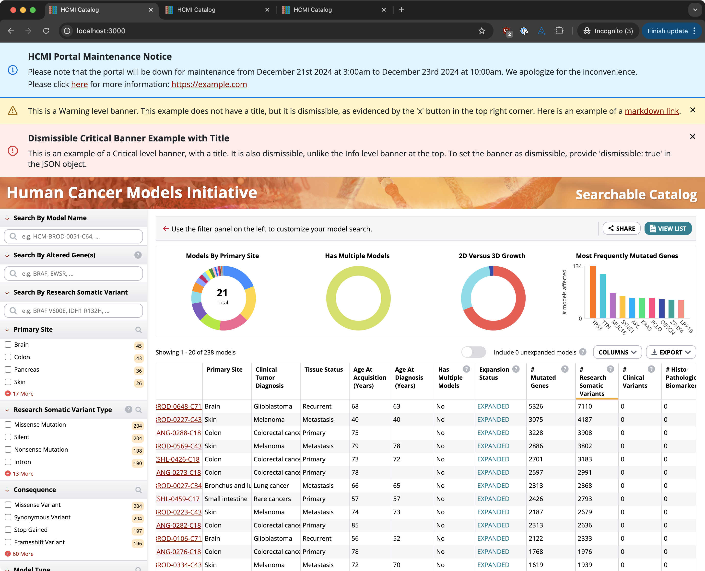

# Banners

The HCMI Portal UI supports displaying informational banners at the top of each page that can be configured through environment variables.



## Usage

To configure banners, provide an array of JSON objects representing the contents of each banner in the `REACT_APP_BANNERS` environment variable for the UI project (`ui/.env`). Multiple banners can be present at once.

### Banner JSON

Each object should be structured as follows:
```json
{
  "title": string,
  "message": string,
  "type": INFO | WARNING | CRITICAL,
  "dismissible": boolean,
}
```

The object properties are as follows:
* `title` <sup>*optional*</sup>
  * Banner title, supports Markdown
  * Example: `"HCMI Portal Publication [Now Available](https://example.com/)"`
* `message` <sup>*optional*</sup>
  * Banner message, supports Markdown
  * Example: `"We are proud to announce a new publication about the impact of HCMI. Read more here: [https://example.com/](https://example.com/)"`
* `type` <sup>*optional*</sup>
  * Banner type
  * Values: `INFO` | `WARNING` | `CRITICAL`
  * Default: `INFO`
* `dismissible` <sup>*optional*</sup>
  * Boolean representing whether the banner should be dismissible or not
  * Values: `true` | `false`
  * Default: `true`

### Example

The following is an example of what the `REACT_APP_BANNERS` env var would look like to display the same banners in the example image above. Note that the JSON has been placed on a single line.

```.env
REACT_APP_BANNERS=[{"type":"INFO","dismissible":false,"title":"HCMI Portal Maintenance Notice","message":"Please note that the portal will be down for maintenance from December 21st 2024 at 3:00am to December 23rd 2024 at 10:00am. We apologize for the inconvenience.  \n   \n Please click [here](https://google.ca) for more information: [https://example.com](https://example.com)"},{"type":"WARNING","dismissible":true,"message":"This is a Warning level banner. This example does not have a title, but it is dismissible, as evidenced by the 'x' button in the top right corner. Here is an example of a [markdown link](https://google.ca/)."},{"type":"CRITICAL","dismissible":true,"title":"Dismissible Critical Banner Example with Title","message":"This is an example of a Critical level banner, with a title. It is also dismissible, unlike the Info level banner at the top. To set the banner as dismissible, provide 'dismissible: true' in the JSON object."}]
```
